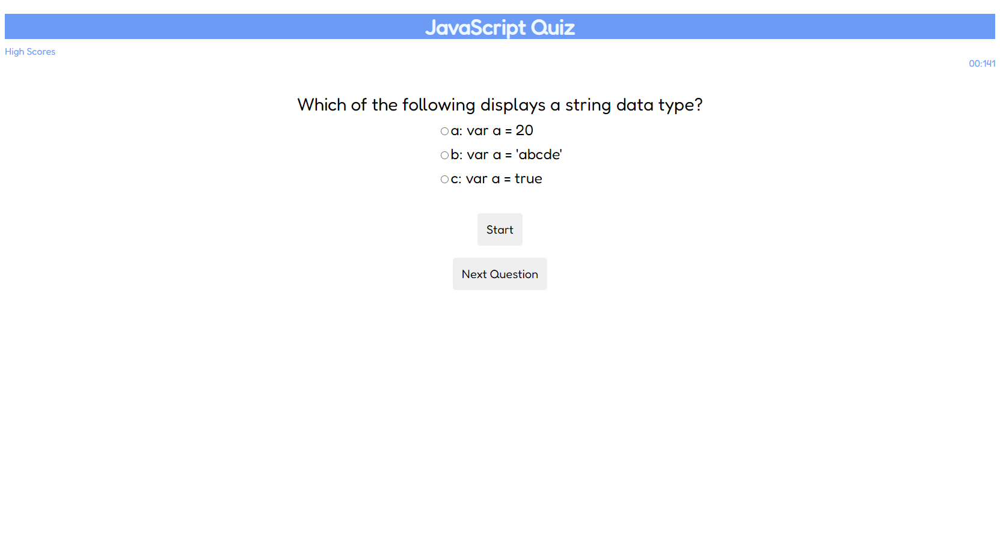

# # JavaScript Coding Quiz

Created a JavaScript quiz application using JavaScript, CSS, and HTML. The quiz is timed and saves the players highscores. 

## Screenshots

## Objectives
Main Objective: The user can take a timed quiz that can save the users past highscores.

- When the start button is clicked the timer begins
- When the question is answered there is another question afterwards
- When the answer is incorrect time is deducted from the clock
- When all the questions are answered or the time runs out the game is over
- Afterwards the user can save there scores and initials

## Link

[Link to finshed webpage]()

## Contributions
I used information I found on [Sitepoint](https://www.sitepoint.com/simple-javascript-quiz/), [Codepen](https://codepen.io/boopalan002/pen/yKZVGa), and [StackOverflow](https://stackoverflow.com/questions/58964755/subtract-time-from-timer-if-answer-is-wrong-creating-a-quiz-javascript) to help me understand some concepts that I struggled and reference back to while creating my code.
## License

[MIT](https://choosealicense.com/licenses/mit/)

